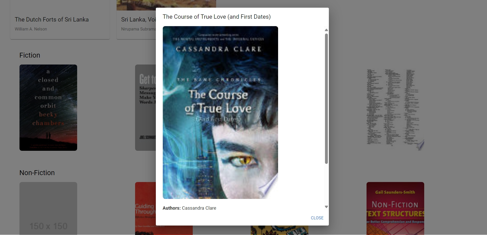

## BookShelf 
<p align="center">
  
</p>

## Setup Instructions

1. Clone the repository.

2. Rename the `application copy.properties` file to `application.properties`
   
3. Replace Your-api-key-google-books in application.properties with your ACTUAL Google Books API key otherwise the project will not work.

## Project Details

This project consists of two parts

1. **Backend**: A Spring Boot application that serves the backend logic and API.
   
2. **Frontend**: A React application that provides the user interface and interacts with the backend.

   
## Prerequisites

Before running the project, make sure you have the following installed:

### Backend (Spring Boot)
- [Java 21](https://openjdk.java.net/)
- [Gradie](https://gradle.org/install/)
- [Spring Boot](https://spring.io/projects/spring-boot) dependencies managed by Gradle
- [IntelliJ Idea](https://www.jetbrains.com/idea/)
  
### Frontend (React)
- [Node.js](https://nodejs.org/) (with npm)

## Run the project

Open the book-shelf-backend Folder with IntelliJ idea and run the BookShelfBackendApplication 

By default the backend will run at 

```bash
http://localhost:8080
```

Navigate to to the frontend directory and run the frontend using

```bash
npm start
```

By default the frontend will run at 

```bash
http://localhost:3000
```


## Home Page Screenshot


## Home Page Screenshot After Search


## Book Card Screenshot After Click



